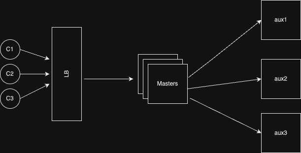

<!-- START doctoc generated TOC please keep comment here to allow auto update -->
<!-- DON'T EDIT THIS SECTION, INSTEAD RE-RUN doctoc TO UPDATE -->
**Table of Contents**  *generated with [DocToc](https://github.com/thlorenz/doctoc)*

- [Distributed-Cache-System](#distributed-cache-system)
  - [Features](#features)
  - [Architecture](#architecture)
  - [Data flow](#data-flow)
  - [Recovery](#recovery)
  - [Usage](#usage)
  - [TODO](#todo)
  - [Configuration](#configuration)
  - [Contributing](#contributing)
  - [License](#license)

<!-- END doctoc generated TOC please keep comment here to allow auto update -->

# Distributed-Cache-System
This implementation of the distributed cache system is an attempt to make a high-performant, scalable and fault-tolerant caching solution to improve performance and efficiency of distributed systems. It utilizes master-slave architecture, where master servers select which auxiliary server to choose when getting or putting key-vals. 


## Features

- Scalable distributed cache system
- Consistent hashing for efficient key distribution
- Master server scaled up to multiple containers
- Load balancing using Nginx
- Auxiliary (aux) servers for caching data
- Rebalance cache data when a node is added/removed or on catastrophic failure
- Backup for catastrophic failure of all aux servers
- Docker containerization for easy deployment
- Metrics monitoring with Prometheus
- Visualization with Grafana
- LRU (Least Recently Used) caching algorithm implemented using Doubly Linked List (DLL) and Hashmap

## Architecture

The Distributed Cache System consists of the following components:

- **Master Server**: The master node acts as the central coordinator and is responsible for handling client requests. It receives key-value pairs from clients and determines the appropriate auxiliary server to store the data using a consistent hashing algorithm. The master node also handles the retrieval of data from auxiliary servers and forwards read requests accordingly.

- **Auxiliary (Aux) Servers**: The auxiliary servers, also known as slave nodes, store the cached data. They are replicated instances deployed in a consistent hash ring to ensure efficient distribution and load balancing. Each auxiliary server is responsible for maintaining a local LRU (Least Recently Used) cache, implemented using a combination of a hashtable and a doubly linked list (DLL). This cache allows for fast access and eviction of less frequently used data.

- **Load Balancing**: The load balancer, typically implemented using nginx, acts as an intermediary between the clients and the master node. It distributes incoming client requests across multiple instances of the master node, enabling horizontal scaling and improved availability.

- **Metrics Monitoring**: Prometheus is integrated into both master and auxliliary server to collect count and response time of GET and POST requests.

- **Visualization**: Grafana is used to visualize the collected metrics from Prometheus, providing insightful dashboards and graphs for monitoring the cache system's performance.
  
- **Docker**: The project utilizes Docker to containerize and deploy the master and auxiliary servers, making it easy to scale and manage the system.

-  **Load Test**: To ensure the system's reliability and performance, a Python script for load testing was developed. The script utilizes Locust, a popular load testing framework.The script defines a set of tasks for load testing the cache system. The put task sends a POST request to the /data endpoint, randomly selecting a payload from a predefined list. The get task sends a GET request to the /data/{key} endpoint, randomly selecting a key from a predefined list. By utilizing this load testing script, it can simulate multiple concurrent users and measure the performance and scalability of the distributed cache system.


## Data flow

1. Client Interaction: Clients interact to distributed cache system via Load Balancer.
   
2. Load Balancer Routing: The load balancer receives the client requests and distributes them among the available instances of the master node using Round-Robin policy. This ensures a balanced workload and improved performance. The configuration can be tweaked to increase the connection pool or increase the number of works processed by each of the worker.
   
3. Master Node Processing: The master node receives the client requests and performs the necessary operations. For write requests (storing key-value pairs), the master node applies a consistent hashing algorithm to determine the appropriate auxiliary server for data storage. It then forwards the data to the selected auxiliary server for caching. For read requests, the master node identifies the auxiliary server holding the requested data and retrieves it from there.
   
4. Auxiliary Server Caching: The auxiliary servers receive data from the master node and store it in their local LRU cache. This cache allows for efficient data access and eviction based on usage patterns.
   
5. Response to Clients: Once the master node receives a response from the auxiliary server (in the case of read requests) or completes the necessary operations (in the case of write requests), it sends the response back to the client through the load balancer. Clients can then utilize the retrieved data or receive confirmation of a successful operation.

## Recovery
- Health of auxiliary servers are monitored by master servers in a regular interval. If any of the auliliary servers go down or respawned, the master knows about it and rebalance the key-val mappings using consistent hashing.
  
- In case if one or more auxiliary nodes are shutdown, the key-vals mappings are sent to the master node which rebalance them using consistent hashing. 
  
- Each auxiliary server backs up data in their container volume every 10 sec, incase a catastrophic failure occurs. These backups are then used when the server is respawned.
  
- In case if one or more auxiliary nodes are respawned, the key-vals mappings from the corresponding nodes in the hash ring are rebalanced using consistent hashing.
  
- When redistributing/remapping the key-vals, a copy is backed up in the shared volume of master containers incase if the whole system goes down and has to be quickly respawned. The backups can be used to salvage as much data as possible. When respawning the backup is rebalanced to corresponding auxiliary server.


## Usage

1. Clone the repository:
   ```
   git clone https://github.com/cruzelx/Distributed-Cache-System.git
   ``` 
2. Build and run the Docker containers for the master and auxiliary servers:
   ```
    docker-compose up --build
   ```
3. Run load testing:
   ```
   ./load_test/loadTest.sh
   ```

## TODO
-  [ ] Support for expirable key-value
-  [ ] Local cache in Master server for better performance
-  [ ] Implement replicas for Auxiliary servers with leader selection (might need zookeeper)


## Configuration

- To adjust the number of auxiliary servers, modify the `docker-compose.yml` file and add/remove auxiliary server instances as needed.

- The cache system's behavior, such as cache size, eviction policies, and request timeouts, can be configured in the server codebase.

## Contributing

Contributions to the Distributed Cache System are welcome! If you find any issues or have suggestions for improvements, please submit a GitHub issue or create a pull request.

## License

This project is licensed under the [MIT License](LICENSE).